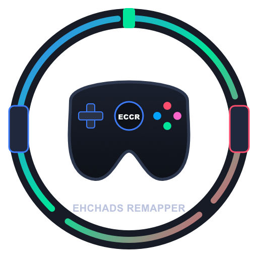

<div align="center">
  

# EhChads Controller Remapper (ECCR)

**A lightweight, high-performance DirectInput remapper and virtual controller emulator built with .NET 10 and Avalonia UI.**

[](LICENSE)
[](https://microsoft.com/windows)
[](https://dotnet.microsoft.com/)
[](https://avaloniaui.net/)
[](https://velopack.io/)

</div>

---

## 🎮 Overview

**EhChads Controller Remapper (ECCR)** bridges the gap between unsupported DirectInput hardware (steering wheels, pedal sets, gated shifters, handbrakes, flight sticks, and legacy gamepads) and modern PC games that exclusively support XInput (Xbox) or DualShock 4 controllers.

ECCR translates raw peripheral inputs into responsive virtual controller targets with near-zero latency, eliminates "double-input" ghosting via automated HidHide integration, and provides visual calibration and mapping wizards in a clean dark UI.

---

## ✨ Key Features

* **🕹️ DirectInput to Virtual Controller Emulation**  
  Map any detected USB device, wheel, or button box to a virtual **Xbox 360** or **DualShock 4** controller powered by **ViGEmBus** with multi-slot targeting (Player 1 through Player 4).

* **🛡️ Integrated HidHide Cloaking**  
  Built-in physical hardware isolation to prevent game conflict and double-input issues without needing external configuration utilities.

* **🪄 Auto-Bind Wizard & Visual Setup**  
  Interactive listen-to-bind step-by-step wizard for rapid axis and button assignment across all connected hardware.

* **⚡ Live Axis Calibration & Deadzones**  
  Interactive axis visualizers with customizable deadzone limits, sensitivity curves, and instant axis inversion toggles.

* **💾 Custom Profiles & Device Presets**  
  Save, load, and manage custom input configurations stored in human-readable local JSON files.

* **🔄 Tray Integration & Background Updates**  
  Minimizes cleanly to the Windows System Tray with optional Windows startup launch and seamless, delta-compressed updates powered by **Velopack**.

---

## 🛠️ Required Drivers

| Driver | Purpose | ECCR Integration |
| :--- | :--- | :--- |
| **ViGEmBus** | Virtual Xbox 360 & DualShock 4 emulation | Automatic health check & 1-click in-app installer |
| **HidHide** | System-level physical device cloaking | Automatic health check & 1-click in-app installer |

---

## 🧰 Tech Stack

| Component | Technology |
| :--- | :--- |
| **Runtime & Language** | .NET 10.0 (C# 14) |
| **UI Framework** | [Avalonia UI 11.2](https://avaloniaui.net/) (Fluent Theme) |
| **Architecture Pattern** | [CommunityToolkit.Mvvm](https://learn.microsoft.com/en-us/dotnet/communitytoolkit/mvvm/) (MVVM) |
| **DirectInput Engine** | [SharpDX.DirectInput](http://sharpdx.org/) |
| **Virtual Emulation** | [Nefarius.ViGEm.Client](https://github.com/nefarius/ViGEmClient) |
| **Device Cloaking** | [Nefarius.Drivers.HidHide](https://github.com/nefarius/HidHide) |
| **Packaging & Updates** | [Velopack](https://velopack.io/) |

---

## 🚀 Getting Started

### Installation
1. Download `ECCR-Setup.exe` from the [Releases](https://github.com/DevEhChad/ECCR/releases) page.
2. Run the installer. ECCR will install directly into your user profile and launch automatically.
3. If prompted by the top warning banner, click to install or repair missing system drivers.

---

## 🏗️ Building From Source

### Prerequisites
* [.NET 10.0 SDK](https://dotnet.microsoft.com/download)
* Visual Studio 2026 or JetBrains Rider

```powershell
# 1. Clone the repository
git clone [https://github.com/DevEhChad/ECCR.git](https://github.com/DevEhChad/ECCR.git)
cd ECCR

# 2. Restore NuGet dependencies
dotnet restore

# 3. Run development build
dotnet run --project ECCR.csproj

# 4. Publish standalone release
dotnet publish -c Release -r win-x64 --no-self-contained -o ./publish