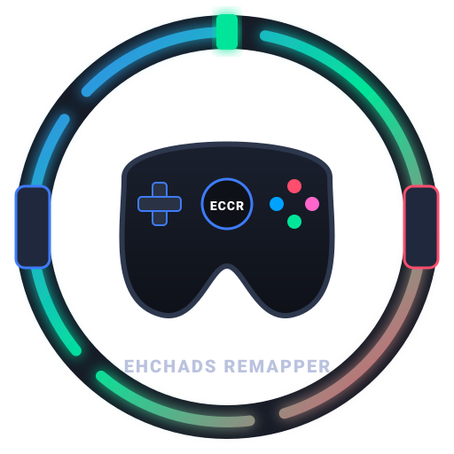

<div align="center">
  

# EhChadsControllerRemapper (ECCR)

**A unified controller remapper, virtual device feeder, and sim-rig hardware combiner built with .NET 10 and Avalonia UI.**

[](https://github.com/DevEhChad/ECCR/actions)
[](LICENSE)
[](https://microsoft.com/windows)
</div>

---

## 📖 Overview

**EhChadsControllerRemapper (ECCR)** consolidates fragmented gaming peripherals and fixes controller compatibility issues. Combine discrete USB sim-racing hardware (independent wheelbases, pedal sets, gated shifters, and handbrakes) into a single virtual DirectInput steering wheel, or convert DirectInput controllers (PlayStation DualSense/DualShock) into native Xbox 360 XInput devices with sub-millisecond polling latency.

---

## ✨ Key Features

* **🏎️ Sim Rig Hardware Combiner**: Merge inputs across separate USB devices (Moza, Logitech, Arduino boards, standalone shifters/handbrakes) into a single virtual **vJoy** DirectInput device.
* **🎮 Universal Gamepad Remapping**: Translate PlayStation and generic DirectInput controllers into virtual **Xbox 360** controllers with native XInput emulation via **ViGEmBus**.
* **🛡️ Integrated HidHide Cloaking**: Hide physical hardware from games directly within the UI to eliminate double inputs, with per-executable whitelist support.
* **⚡ Live Axis Calibration & Deadzones**: Interactive axis detection, deadzone sliders, min/max travel normalization, and axis inversion toggles.
* **🎯 Visual Button Mapping & Presets**: Automatic device detection featuring PlayStation and Xbox button glyphs, gated shifter gates (1st–7th + Reverse), and interactive listen-to-bind inputs.
* **🔄 Seamless Auto-Updates & Tray Integration**: Native Windows system tray minimization, run-on-startup toggle, and background delta updates powered by **Velopack**.

---

## 🛠️ Required System Drivers

| Driver | Function | Status Detection |
|---|---|---|
| **ViGEmBus** | Virtual Xbox 360 controller emulation | Built-in automatic check & 1-click installer |
| **vJoy** | Virtual DirectInput steering wheel & multi-axis feeder | Built-in automatic check & 1-click installer |
| **HidHide** | System-level physical device cloaking | Built-in automatic check & 1-click installer |

---

## 🚀 Getting Started

### Installation
1. Download the latest `ECCR-Setup.exe` from the [Releases](https://github.com/DevEhChad/ECCR/releases) page.
2. Run the installer. ECCR will create desktop shortcuts and register automatic background update channels.
3. On first launch, install any missing drivers flagged in the top warning banner.

### Building From Source
* **Prerequisites**: .NET 10 SDK & JetBrains Rider / Visual Studio 2026.

```powershell
# Clone repository
git clone [https://github.com/DevEhChad/ECCR.git](https://github.com/DevEhChad/ECCR.git)
cd ECCR

# Restore and build solution
dotnet restore
dotnet build -c Release